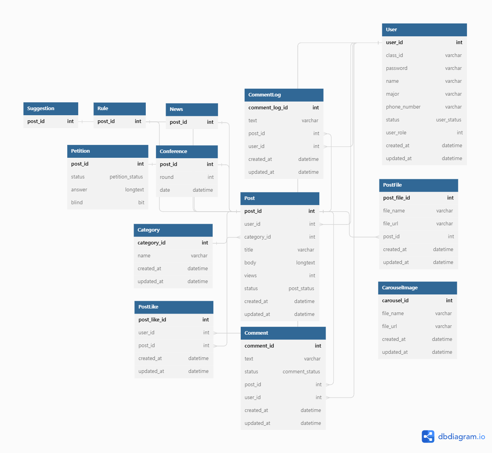

# 단국대학교 총학생회 홈페이지 API 서버

## 도메인 모델

## ERD

## API 설계

<iframe width="100%" height="400px" style="border: 1px solid gray" src="https://docs.google.com/spreadsheets/d/e/2PACX-1vTlTkun42s-MDzTOTRyZHzhei-LFUOaKmT25nej-lLlPls_ry8oW2Um8TQuf8mvhiwaYova0_6gevJ4/pubhtml?gid=72451226&amp;single=true&amp;widget=true&amp;headers=false"></iframe>