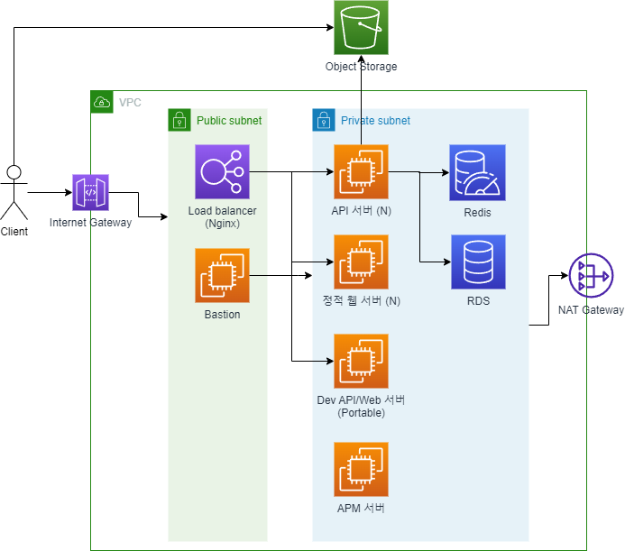
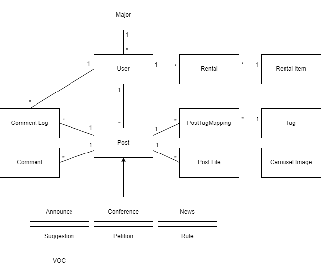
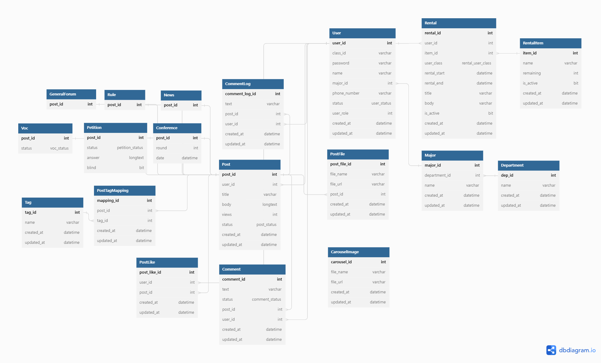

# 단국대학교 총학생회 홈페이지 API 서버

단국대학교 총학생회 홈페이지 API서버입니다.

## 개요

### 배포 서버 주소

- 개발 서버: <_hidden_>
- 운영 서버: https://dkustu.com/api

### 클라우드 서버 아키텍처

서버 구성에 대한 고민: [Blog](https://won983212.github.io/posts/server-architecture/)

### 주요 사용 기술

 - Java 11 (OpenJDK)
 - Spring/Spring Boot 2
 - Github Actions
 - Swagger/SpringDoc
 - JPA
 - JUnit5/Mockito/AssertJ/TestContainers
 - 그 외 상세 라이브러리 및 버전 정보 [build.gradle](https://github.com/EveryUniv/student-council-homepage-backend/blob/main/build.gradle)

### 백엔드 배포 환경

- NHN Cloud
- Ubuntu 20.04
- MySQL 5.7.26
- Redis 7.0.5
- Docker 23.0.1
- Docker Compose 2.16.0

### 주요 기능

 - 관리자 게시판 (소식, 회의록, 학칙)
 - 사용자 게시판 (자유, 청원, VOC)
   - 좋아요, 댓글, 신고, 게시글 Tag
 - 시간표 CRUD, 학교 수업 시간표
 - 학사일정 보기
 - 버스 도착시각 예측
 - 대여 물품

## 기능 상세

### 모든 게시판 ([설계 고민](https://won983212.github.io/posts/post-architecture/))

 - 제목과 본문을 작성할 수 있다.
 - 파일을 첨부할 수 있다.
 - 댓글을 작성할 수 있다. (일부 게시판 제외)
 - 글과 댓글에 좋아요를 누를 수 있다. ([좋아요 관련 글](https://won983212.github.io/posts/how-to-implement-like/))
 - 신고할 수 있다. (일부 게시판 제외, [관련 Issue](https://github.com/EveryUniv/student-council-homepage-backend/issues/177))
 - 태그를 달 수 있다.
 - 글 CRUD
 - 관리자에 의한 글 Blind
 - 내가 작성한 글, 댓글단 글, 좋아요한 글을 볼 수 있다. ([관련 Issue](https://github.com/EveryUniv/student-council-homepage-backend/issues/174))
 - 도배 방지 기능이 있다.
 - 조회수 기능이 있다. (IP로 구분, 30분당 1회 조회수)
   
### 자유 게시판
 - 사용자 이름이 닉네임으로 표시된다.

### 청원 게시판
 - 청원을 올리고, 동의를 받을 수 있다.
 - 150개 이상의 동의를 받으면 총학생회의 답변을 받을 수 있다.
 - 90일이 지나면 만료된다. 만료된 글은 동의 및 답변을 할 수 없다.
 - 동의한 경우 학과별 통계에 누적된다. 학과별 동의 현황을 볼 수 있다. ([관련 Issue](https://github.com/EveryUniv/student-council-homepage-backend/issues/212#issuecomment-1492945898))

### 시간표 ([관련 고민 글](https://won983212.github.io/posts/how-to-implement-timetable/))
 - 내 시간표를 앱에 저장하고, 공유할 수 있다.
 - ERD 구상
 - 시간표를 CRUD할 수 있다.
 - 학교 수업 목록을 볼 수 있다. (스크래핑)
 - 수업은 custom color를 지정할 수 있다.

### 학사일정
 - 학교 학사일정을 메인 페이지에서 볼 수 있다.
 - 학교 학사일정을 주기적으로 스크래핑하고, api로 제공한다.
 - 특정 기간을 지정하면 그 기간에 걸친 모든 학사 일정을 보여준다.

### 버스 도착시각 예측 ([관련 고민 글](https://won983212.github.io/posts/bus-collector/))
 - 학교 정문은 버스 기점과 가까워 버스 정보 앱에서도 도착 시각을 볼 수 없다.
 - 버스 도착 시각을 수집한 데이터를 바탕으로 시간표를 만들어 다음 버스를 예측한다.
 - 시간표를 기준으로 버스 도착 정보를 제공한다.

### 대여 물품
 - 학생은 우산, 라켓 등 필요한 물품들을 대여할 수 있다.
 - 총학생회에서 대여할 수 있는 물품 목록(이름, 대여 가능한 개수)을 볼 수 있다.
 - 대여 현황을 볼 수 있다.
 - 물품 반납 처리는 총학생회에서 직접한다.

## DB 설계

### 도메인 모델 설계

### ERD

